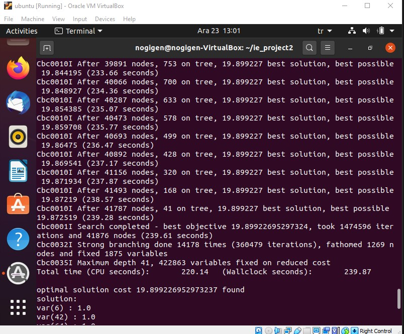
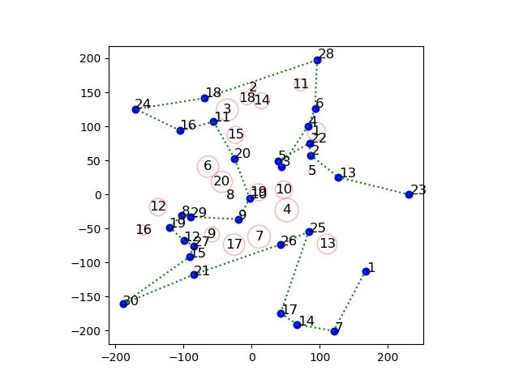

# modified-tsp
We are given a problem that is similar to a Traveling Salesman Problem with some constraints. We have 30 islands that we have to travel and since the road between them differs as Asphalt, Concrete and Gravel, the cost of traveling between 2 islands is different from the others. Also, coordinates of the islands can make time between 2 islands longer or shorter. In addition to that we have storm constraints so that when a storm happens between 2 islands, the truck cannot use that road. To solve this problem we mainly used a TSP algorithm

It is necessary to note that we have encountered a memory issue when running
the Windows version of Python MIP Solver and it prevented us from running
our script in Windows operating systems. This issue is unrelated to our solution
and it is caused by the way the MIP Solver runs in Windows. However, the
script can be run in Linux and MacOS and it will successfully exit with
corresponding objective value and optimum route.

- data.txt is the generated output file from tsp.py which will be used in plot.py to create a plot. It also contains information about the optimum route, optimum cost etc.
- data.xlsx is the input file which contains the information about coordinates of the islands/storms etc.
- guide.pdf explains the problem and the solution.
- plot.py plots the optimum route and the storms.
- tsp.py solves the modified tsp problem with a DP approach. I used "MIP" library in my code.

It should take around 1 minute to run tsp.py

## outputs after running tsp.py and plot.py

|  | 
|:--:| 
| *output-1* |

|  | 
|:--:| 
| *output-2* |

|  | 
|:--:| 
| *plot of the route and the storms* |

